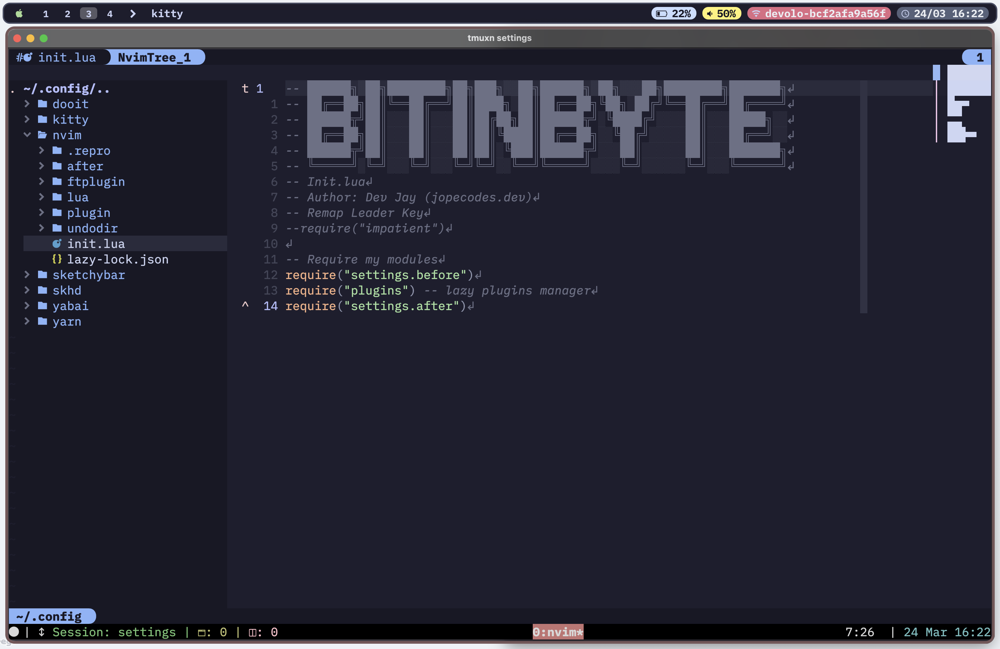

# Configs used by BitInByte

██████╗░██╗████████╗██╗███╗░░██╗██████╗░██╗░░░██╗████████╗███████╗
██╔══██╗██║╚══██╔══╝██║████╗░██║██╔══██╗╚██╗░██╔╝╚══██╔══╝██╔════╝
██████╦╝██║░░░██║░░░██║██╔██╗██║██████╦╝░╚████╔╝░░░░██║░░░█████╗░░
██╔══██╗██║░░░██║░░░██║██║╚████║██╔══██╗░░╚██╔╝░░░░░██║░░░██╔══╝░░
██████╦╝██║░░░██║░░░██║██║░╚███║██████╦╝░░░██║░░░░░░██║░░░███████╗
╚═════╝░╚═╝░░░╚═╝░░░╚═╝╚═╝░░╚══╝╚═════╝░░░░╚═╝░░░░░░╚═╝░░░╚══════╝

## Screen



## Information

This config only works with Neovim +0.8. It is almost 100% Lua and ViM doesn't support it.

## External Dependencies

### Neovim

1. Neovim nightly (+0.8)
2. Packer.nvim
<!-- 3. Python autopep8 is required to pretify -->
3. ripgrep: https://github.com/BurntSushi/ripgrep => used in Telescope
<!-- 4. Patched Cascadia Code Font (Nerd Fonts) (Old font) -->
4. Patched Victor Mono Font (Nerd Fonts)
5. Patched IBM Plex Mono Font (Nerd Fonts) (Blex Mono)
6. MacTex

### Terminal/Homebrew

1. Tmux | Kitty
<!-- 2. Cascadia code font (To got the most of this config, use a patched font from nerd fonts) -->
2. Oh My ZSH
3. Powerlevel10k (terminal)
4. Ranger
5. LazyGit
6. LazyDocker
7. Zathura PDF

### Packer

In order to be able to benefit from the lazyloading, packer need to be synchronized and/or compiled to create the lazy loading file. Trust me, it's a huge difference on startup time, I've discovered in my hard way.
Also, the config tag on packer config only works if we synchronize or compile the packer.

### Oh My ZSH

1. zsh-autosuggestions: https://github.com/zsh-users/zsh-autosuggestions - Install the oh my zsh version of it
2. zsh-syntax-highlighting: https://github.com/zsh-users/zsh-syntax-highlighting - Install the oh my zsh version of it

## Config installation

You just only need to copy the config files you want to use and it should work. If it throws an error, just try to open the editor a couple of times so that all external dependencies finish installation.

<!-- You can install this config Neovim using the start.sh file. -->
<!---->
<!-- If you want to install you should download this config and inside of this config directory, you should run the following command: -->
<!---->
<!-- ```zsh -->
<!-- sudo ./start.sh install mac -->
<!-- ``` -->
<!---->
<!-- And to update you can use the following command: -->
<!---->
<!-- ```zsh -->
<!-- sudo ./start.sh update mac -->
<!-- ``` -->
<!---->
<!-- You should install a patched Cascadia Font and attribute it to the used terminal in order to get the icons on telescope and on nerdtree -->
<!---->
<!-- You should install MacTex in order to compile latex documents with vimtex -->

## LSP Sources

Most of the LSPs will be detected from the filetype and if they are being required on lsp side, mason will detect and install the lsps. Some are still not supported and need to be installed manually though.

<!-- In order to use the sources, you should install LSP's... Most of them you can find it via npm. -->
<!---->
<!-- For Java however, you need to download the jdtls via milestone and copy it into a directory (I use the /Library/java directory). -->
<!-- Then, you should specify the path to the jdtls in the .zshenv file in order to add the path into the environment. -->
<!---->
<!-- Most of the lsp's require .git in order to be able to find the root directory. -->

## JavaScript

For js and ts files, we need to have a jsconfig.json file in order to the project be able to know how to auto-import from other files: https://code.visualstudio.com/docs/languages/jsconfig
Also, the eslint_d and prettierd need to be globally installed and should be configured with it's own config files in order to use them.

## Java

We need to download jdtls in order for it to work.

First of all, we need to download a milestone build from the github and we can save it whenever we want. In my case, I've just saved in /Library/Java directory.

Then, we need to update our .zshenv file in order to have all of the java related stuff in our path.

Last, we need to update the ftplugin java.lua file with the correct paths and that's it. It should then work in a java file, out of the box

<!-- ## Lua -->
<!---->
<!-- In order for lua code formatter to work, we need to install a lua formatter, for that we can use the following command: -->
<!---->
<!-- ```zsh -->
<!-- yarn global add lua-fmt -->
<!-- ``` -->
<!---->
<!-- It's more as a workaround that could be a feature in the future to integrate it with the core nvim lsp but for now, formatter.nvim is the solution. -->

## Rust

In order to work with rust lsp, we need to install rls and we need to always bootstrap a new project with the help of cargo

## C#

In order to use csharp, you need to download the onisharp (https://github.com/OmniSharp/omnisharp-roslyn) and place it in "$HOME/Repositories/language-servers/omnisharp/run" if the folders doesn't exist, you should create them. You should download the omnisharp-osx.tar.gz which contain the run executable.

## Ranger

In order for ranger to work properly, we need to install a couple of dependencies. This will be applied for kitty terminal.

```zsh
brew install highlight
pip install pillow ranger-fm
```

## Anaconda

In order to use conda command, we need to perform the following command, after anaconda installation:

```zsh
~/opt/anaconda3/bin/conda init zsh
```

<!-- ## Web Development -->
<!---->
<!-- We need to install some stuff regarding web development. emmet-ls, tserver and intelephense from npm. -->

## NV-DAP

It needs to get installed the javascript debugger and it uses the firefox. Refer to the dap documentation

<!-- ### Treesiter Commands -->
<!---->
<!-- For treesitter, only for neovim, you can install language interpreter by :TSInstall <language> -->

## Treesitter

Tressitter will also detect a new filetype and download the parser by itself.

### Zathura PDF

To install zathura, we need to install poppler.

Then, we can install zathura like this:

```zsh
brew install zathura --with-synctex
brew install zathura-pdf-poppler
```

We also need to follow some steps that are in the zathura brew github page.

## Docker

Ubuntu needs to be composed with the following command:

```zsh
docker compose up -d
```

And then to run:

```zsh
ssh -p 2022 root@localhost
```

## Brewfile

To backup installed packages:

```zsh
brew bundle dump
```

To install from brew file:

```zsh
brew bundle
```

<!-- To install zathura, we need to install the meson: -->
<!-- ```Python -->
<!-- pip3 install meson -->
<!-- ``` -->
<!---->
<!-- We also need to install popler, we can install it from the homebrew. -->
<!---->
<!-- Then, we need to install girara, zathura and zathura-pdf-popler. We only need to follow the steps on the website. -->
<!---->
<!-- Then, we need to download Zathura and build it with meson and ninja. -->

## Fonts

To install a patched font, download all of the fonts you want to use (at least regular, italic and bold) and on the folder where you downloaded them, select all of them, right click of the mouse on the selection and then open. This will ensure that all of the fonts are grouped installed and linked
